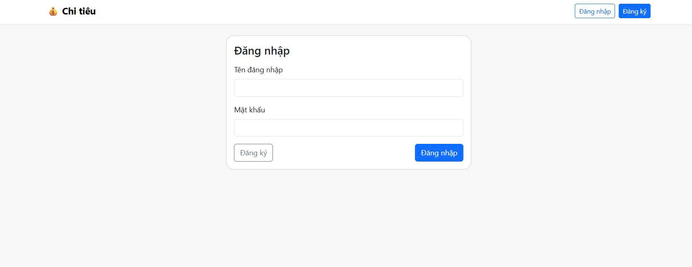
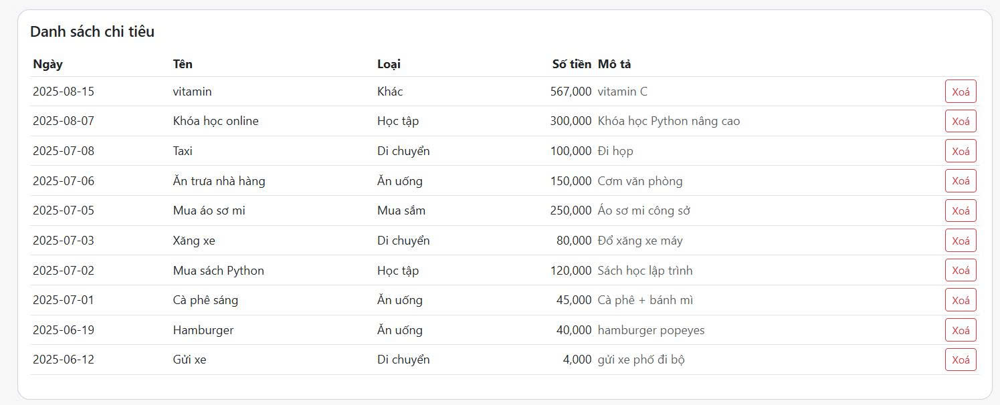
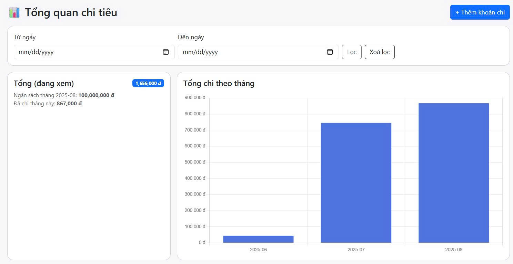

# 💰 Quản Lý Chi Tiêu Cá Nhân

Ứng dụng Web giúp quản lý chi tiêu cá nhân, hỗ trợ **nhiều người dùng** với chức năng **đăng nhập**, **đặt ngân sách**, và **theo dõi bằng biểu đồ**.

---

## ✨ Tính năng

- **Đăng ký / Đăng nhập**  
  Mỗi người dùng có dữ liệu riêng, bảo mật bằng hash mật khẩu.
  
- **Thêm, xóa khoản chi**  
  Nhập tên, số tiền, mô tả, loại chi tiêu và ngày.

- **Phân loại chi tiêu**  
  Chọn loại: Ăn uống, Mua sắm, Học tập, Di chuyển, Khác.

- **Lọc dữ liệu theo ngày**  
  Xem lại chi tiêu trong một khoảng thời gian cụ thể.

- **Biểu đồ thống kê**  
  - Biểu đồ tròn: phân bổ chi tiêu theo khoản
  - Biểu đồ cột: tổng chi tiêu theo tháng

- **Ngân sách hàng tháng**  
  Đặt giới hạn ngân sách và cảnh báo khi vượt.

- **Hỗ trợ giao diện Bootstrap**  
  Dễ dùng, gọn gàng, có thể nâng cấp sang Tailwind.

---

## 🛠️ Công nghệ sử dụng

- **Backend:** Python Flask
- **Database:** SQLite
- **Frontend:** HTML, Bootstrap 5, Chart.js
- **Auth:** Flask session + werkzeug.security (hash mật khẩu)

---

## 📦 Cài đặt & Chạy ứng dụng

### 1. Clone project
```bash
git clone https://github.com/<username>/quan-ly-chi-tieu.git
cd quan-ly-chi-tieu

### 2. 📚 Thư viện Python sử dụng

- flask — Framework web chính.

- werkzeug — Hỗ trợ bảo mật mật khẩu (hashing).

- sqlite3 — Thư viện tích hợp sẵn Python để kết nối SQLite.

- datetime — Xử lý ngày tháng.

- secrets — Tạo khóa bí mật (secret key).

### 3. Chạy ứng dụng
python app.py

Ứng dụng chạy tại: http://127.0.0.1:5000

Lần chạy đầu, app sẽ tự tạo database chi_tieu.db và chuẩn hoá cột ngay.
## 🖼 Ảnh minh họa

### Trang đăng nhập



### Trang quản lý chi tiêu



### Biểu đồ thống kê


